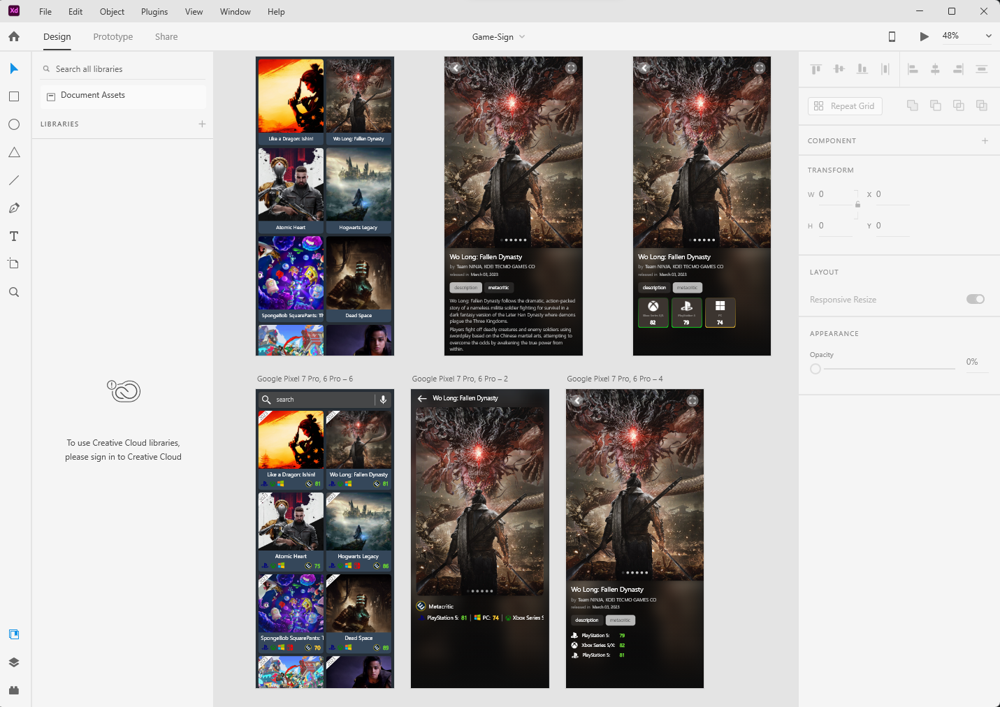

# Game Sign

### See the new games, images, metacritic score, and details.

## Adobe XD prototype - [link](./Game-Sign.xd)

  

## Screenshots

  
  
  
  

## Demo
https://user-images.githubusercontent.com/47711934/230319732-af024009-b988-4694-b2d7-0935ab556ce0.mp4

# Technical Description of Game Sign App
The Game Sign app is built using MVVM architecture, Data Binding, and Jetpack. It also utilizes the Hilt dependency injection framework to manage its dependencies.

## Architecture Layers

### Data Layer
The Data layer includes DTO (Data Transfer Object) classes that represent the API models used in the app. The API is accessed using an `ApiHelper` interface and its implementation class `ApiHelperImpl`. The layer also includes an `ApiInterceptor` and an `ApiProvider` abstract class that contains a `getResult()` method, which is used to handle API responses. The `ApiHelperImpl` class uses the `ApiService` interface from Retrofit to make API calls. The `Resource` class is used to handle API responses and contains success and error generic methods. The `getResult()` method in the `ApiProvider` class returns a `Resource` object that is used to handle API responses. The Repository uses the `ApiHelper` interface to make API calls and returns the `Resource` class to the ViewModel. Kotlin coroutines are used for API layer operations and are handled in the ViewModel with `ViewModelScope`.

### Repository Layer
The Repository layer provides an interface and implementation for accessing the data sources, which can be either the API or a local database. It provides a set of methods for fetching and updating data in a standardized way.

### DI Layer
The DI layer includes two modules: `AppModule` for configuring the API and `RepositoryModule` for providing the repository and its implementation. It also includes two qualifiers: `ApiKey` and `BaseUrl`. 
The `AppModule` provides an `OkHttpClient` instance with an `Interceptor` for adding the API key to requests, and a `Retrofit` instance with the base URL set to the value provided by the `BaseUrl` qualifier. The `RepositoryModule` provides the repository interface and its implementation, and distinguishes between different implementations using the `ApiKey` qualifier.

### Mapper Layer
The Mapper layer uses the Mapstruct library to map DTOs to the application models. This layer is used to abstract away the details of the API and provide a simple interface for the ViewModel interact with.

### Util Layer
The Util layer contains various utility classes, such as `Font`, `GlideUtil`, and `Resource`. The `Resource` class is particularly important, as it is used to represent the success and error states of API calls.

### UI Layer
The UI layer includes all the visual components of the app, such as:
- Activities
- Fragments
- Adapters
- Custom Ui Elements
- ViewModels

In this app, I've used a `TransformationLayout` for recycler items to animate the transition between two activities. Additionally, also I've used `ViewPump` to set custom fonts throughout the app.

## Conclusion
Overall, the Game Sign app demonstrates the use of MVVM architecture, Hilt for DI, Data Binding and Jetpack libraries, and various layers for handling data and providing a clean, modular architecture.

## Installation and Setup
To install and set up the app, follow these steps:

1. Clone the repository.
2. Import the project into Android Studio.
3. Build the project using Android Studio.
4. Run the app on an emulator or device.

## Usage
**Note:** this app use [RAWGB API](https://rawg.io/apidocs) (if you are in Iran you should turn on your VPN)
  
To use the app, follow these steps:

1. Open the app.
2. See the list of latest video game releases.
3. Click on a game to see its details, including images and Metacritic score.

## Contributing
To contribute to this app, follow these steps:

1. Fork the repository.
2. Make changes and submit a pull request.
3. Ensure that all changes follow the MVVM architecture and adhere to the code style guidelines.
4. Ensure that all changes are thoroughly tested.

## TODO
* Add unit test
* Add searchbar, sort, filter

## License
This app is licensed under the MIT license. See the LICENSE file for more details.
